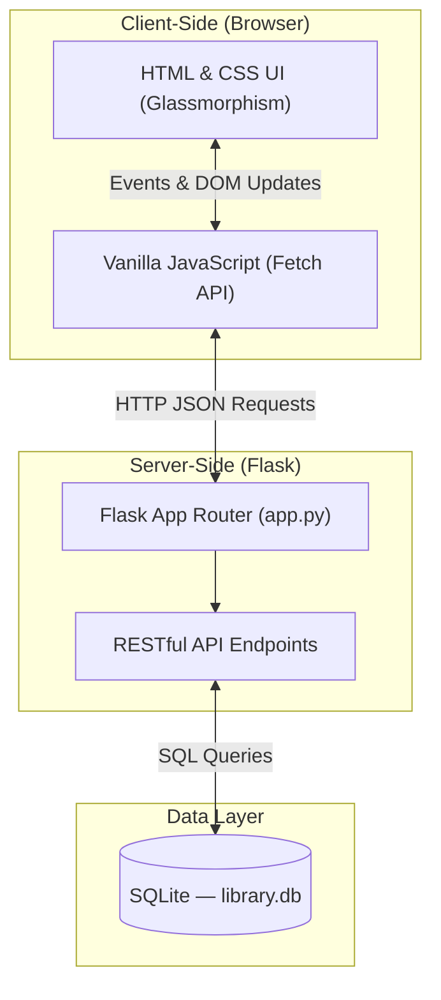

<div align="center">
  <h1>📚 ShelfSync</h1>
  <p><em>Next Gen Library Management</em></p>
  
  [](https://www.python.org/)
  [](https://flask.palletsprojects.com/)
  [](https://www.sqlite.org/)
  [](https://developer.mozilla.org/en-US/docs/Web/JavaScript)
  [](https://shelf-sync-murex.vercel.app/)

  <br/>
  <a href="https://shelf-sync-murex.vercel.app/">
    <strong>🌐 View Live Demo → shelf-sync-murex.vercel.app</strong>
  </a>
</div>

---

## 🚀 Elevator Pitch
Managing a library shouldn't require complex, bloated software. **ShelfSync – Next Gen Library Management** provides a sleek, responsive **Web Application** for day-to-day operations and a lightweight **Command Line Interface (CLI)** for quick terminal-based tasks. Built with performance and simplicity in mind, it's designed to make managing books, tracking student records, and handling fines completely frictionless.

## 💡 The Problem & Solution
**The Problem:** Traditional library systems are often clunky, hard to set up, and lack modern UI/UX principles, leading to slow operations and a steep learning curve for librarians.

**The Solution:** We built a zero-configuration, Dynamic Single Page Application (SPA) powered by a lightweight Flask backend and a modern glassmorphism UI. It features real-time search, automated fine calculations, and instant book returns.

---

## 🌟 Key Features

| Feature | Description |
|---|---|
| **Dashboard Overview** | Displays total book titles, total copies, and available copies with a full catalog table. |
| **Members & Fines** | View registered members, their checked-out books, and dynamically calculated fines (₹30/day). |
| **Issue & Return Ledger** | Centralized interface for managing all book transactions with inline return actions. |
| **Real-time Search** | Instantly filter the catalog by title, author, or ISBN. |
| **Dual Interface** | Access via the rich Web UI or the lightning-fast Python CLI. |

---

## 🛠️ Tech Stack

- **Frontend:** HTML5, CSS3 (Glassmorphism design), Vanilla JavaScript (Fetch API)
- **Backend:** Python 3.12, Flask
- **Database:** SQLite (Zero-config, serverless)
- **Architecture:** RESTful APIs, Client-Server model

## 🏗️ System Architecture

The application communicates over HTTP via RESTful APIs, backed by a persistent SQLite database.



### Database Schema

| Table | Key Columns |
|---|---|
| `books` | `id`, `title`, `author`, `isbn` (unique), `total_copies`, `available_copies` |
| `students` | `id` (primary key), `name` |
| `issued_books` | `id`, `student_id` (FK), `isbn` (FK), `issue_date`, `due_date` |

---

## 💻 How to Run Locally

### Prerequisites
- Python 3.7+ installed on your system.

### 1️⃣ Running the Web Application
1. Clone the repository and navigate to the project directory.
2. Install the required dependency:
   ```bash
   pip install flask
   ```
3. Start the Flask application server:
   ```bash
   python app.py
   ```
4. Open your web browser and navigate to: **http://127.0.0.1:8000**
*(A `library.db` file will be auto-created on first run)*

### 2️⃣ Running the CLI Application
Need to run tasks quickly from the terminal? Use the standalone CLI version!
1. Open your terminal in the project directory.
2. Start the CLI application:
   ```bash
   python library_management.py
   ```
3. Follow the interactive on-screen prompts.

---

## 🔮 What's Next? (Future Scope)
- **Authentication & Roles:** Implementing Login functionality with Admin and Librarian roles.
- **Email Notifications:** Automatic email alerts for overdue books.
- **Barcode Scanner Integration:** Using the webcam to scan ISBN barcodes for instant checkouts.
- **Cloud Deployment:** Containerizing with Docker and deploying to AWS/Heroku.

---

## 👨‍💼 Team & Credits
- **Developer:** Soumyaditya
- **Role:** Full-Stack Developer & Library System Administrator
- **Project Version:** 2.0 (Redesign Edition - Hackathon Ready)
